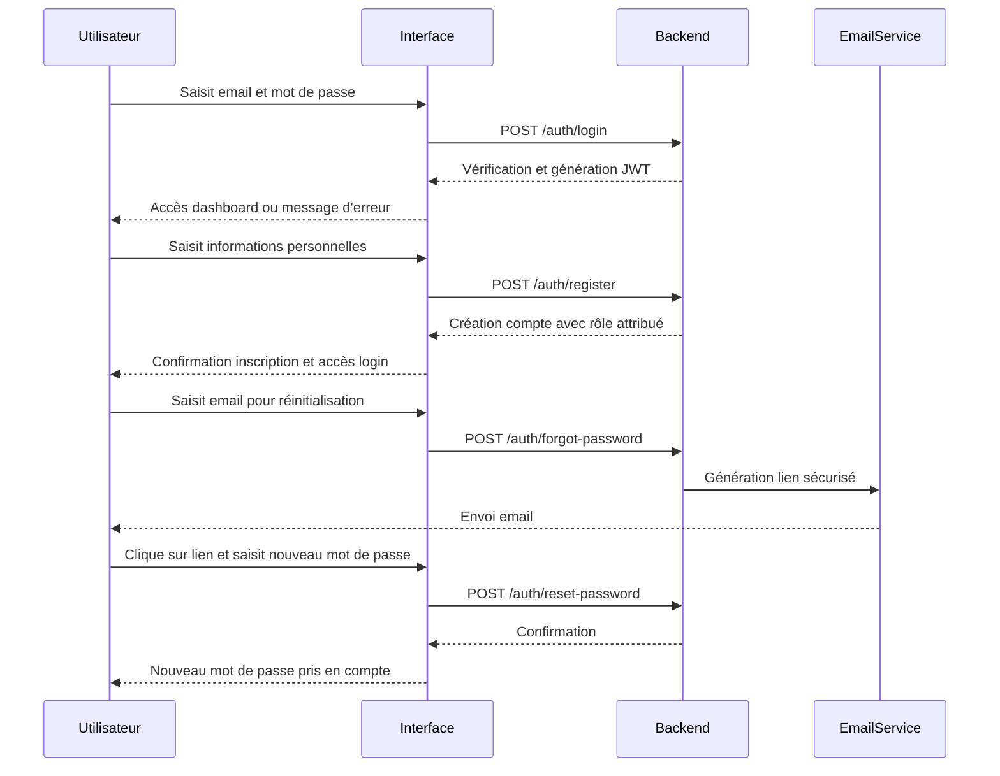
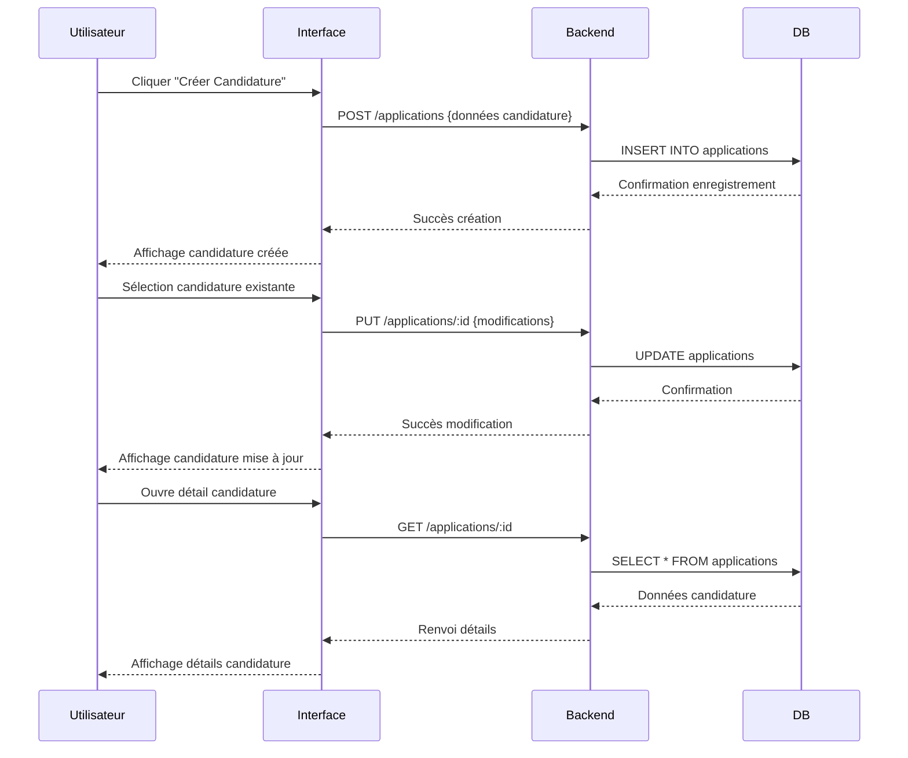
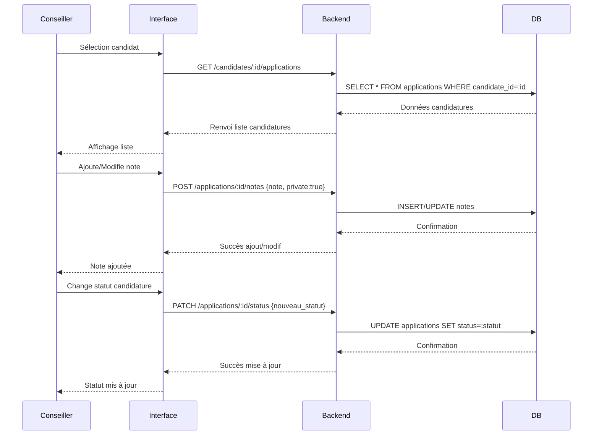
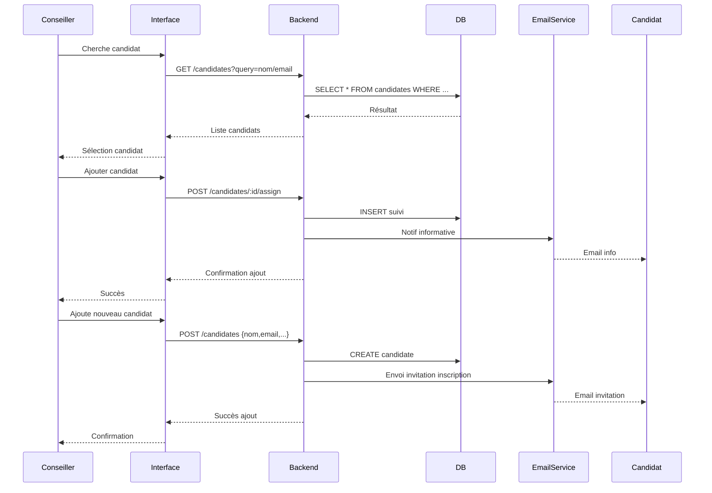
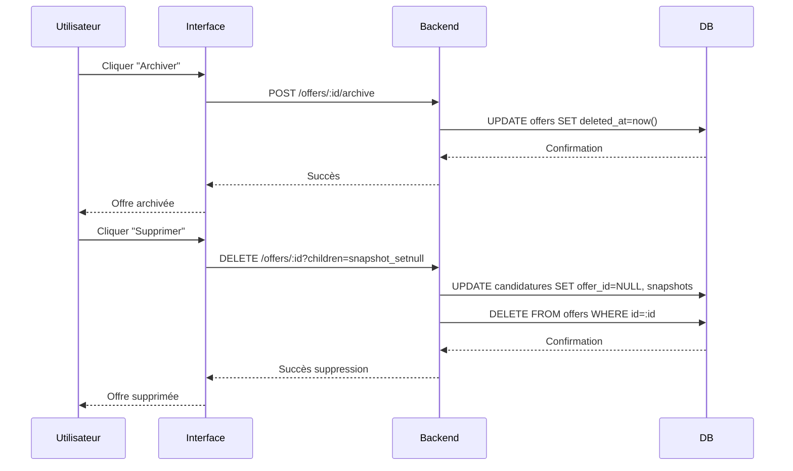

# Cahier des charges

## 

## **Cas d'utilisation : Authentification / Inscription**

### Objectif

Permettre à un utilisateur (Candidat ou Conseiller) de créer un compte, de se connecter à la plateforme et de récupérer son mot de passe en cas d’oubli.

### Description principale (scénario nominal)

1. L’utilisateur accède à la page d’authentification.
2. L’utilisateur choisit une des actions : **Se connecter**, **S’inscrire**, ou **Mot de passe oublié**.
3. Pour la connexion :

   * L’utilisateur saisit ses identifiants (email + mot de passe).
   * Le système vérifie les informations via Spring Security.
   * En cas de succès, JWT est généré et l’utilisateur est redirigé vers son dashboard.
4. Pour l’inscription :

   * L’utilisateur saisit ses informations personnelles.
   * Le rôle est attribué automatiquement (Candidat ou Conseiller).
   * Un compte est créé et l’utilisateur peut se connecter immédiatement.
5. Pour mot de passe oublié :

   * L’utilisateur saisit son email.
   * Le système envoie un email de réinitialisation avec un lien sécurisé.
   * L’utilisateur clique sur le lien et définit un nouveau mot de passe.

### Scénarios alternatifs

* **Identifiants invalides** : message d’erreur et possibilité de réessayer.
* **Email déjà utilisé** lors de l’inscription : message d’erreur et suggestion de récupération du mot de passe.
* **Lien de réinitialisation expiré** : notifier l’utilisateur et générer un nouveau lien sur demande.

### Exigences fonctionnelles / techniques

* Les actions **Se connecter / S’inscrire / Mot de passe oublié** sont accessibles sans authentification préalable.
* Toutes les autres fonctionnalités nécessitent un JWT valide pour être accessibles.
* Les mots de passe sont stockés de manière sécurisée (hash + sel).
* Les emails de notification doivent être envoyés de manière fiable et sécurisée.
* Validation côté serveur et côté client des formats d’email et de mot de passe.

---

### Diagramme séquentiel Mermaid

## **Cas d'utilisation 2 : Créer / Modifier Candidature**

### Objectif

Permettre au candidat ou au conseiller de créer, modifier ou consulter une candidature à une offre.

### Description principale (scénario nominal)

1. L’utilisateur accède à la page “Mes candidatures”.
2. L’utilisateur clique sur **Créer une candidature** ou sélectionne une candidature existante pour modification.
3. Pour la création :

   * Sélection de l’offre (ou candidature spontanée).
   * Saisie des informations nécessaires (CV, lettre de motivation, date, statut initial).
   * Validation et enregistrement de la candidature.
4. Pour modification :

   * L’utilisateur modifie les champs autorisés.
   * Validation et sauvegarde.
5. Pour consultation :

   * Affichage du détail de la candidature et du statut actuel.

### Scénarios alternatifs

* **Offre archivée ou supprimée** : affichage d’un message et impossibilité de postuler.
* **Champ obligatoire manquant** : message d’erreur et demande de correction.

### Exigences fonctionnelles / techniques

* Authentification obligatoire (JWT valide).
* Validation côté serveur et client des données saisies.
* Historique des modifications conservé pour audit interne.

### Diagramme séquentiel Mermaid

---

## **Cas d'utilisation 3 : Suivi / Gestion Candidatures**

### Objectif

Permettre au conseiller de suivre la progression des candidatures d’un candidat et d’ajouter des notes privées ou commentaires consultatifs.

### Description principale (scénario nominal)

1. Le conseiller accède à la liste des candidats suivis.
2. Sélectionne un candidat pour consulter ses candidatures.
3. Le conseiller peut :

   * Ajouter ou modifier des notes privées sur la candidature.
   * Mettre à jour le statut de la candidature (Inbox, Envoyée, Relance, Entretien, Refusé, Signé, Archivée).
   * Filtrer et trier les candidatures.

### Scénarios alternatifs

* **Candidature archivée** : ne pas permettre de modification.
* **Candidature refusée** : possibilité de commenter mais pas de changer le statut.

### Exigences fonctionnelles / techniques

* Authentification obligatoire.
* Notes privées uniquement visibles par le conseiller.
* Historique des modifications conservé pour audit.

### Diagramme séquentiel Mermaid

---

## **Cas d'utilisation 4 : Ajouter Candidat par Conseiller**

### Objectif

Permettre au conseiller d’ajouter un candidat existant ou non inscrit et de le suivre.

### Description principale (scénario nominal)

1. Le conseiller clique sur **Ajouter un candidat**.
2. Recherche le candidat par nom, email ou identifiant interne :

   * **Cas 1 : candidat existant** : ajout immédiat à sa liste, notification informative au candidat.
   * **Cas 2 : candidat non inscrit** : envoi d’invitation par email, pré-remplissage des notes et ressources disponibles.
3. Une fois le candidat actif, les notes et ressources deviennent visibles.

### Scénarios alternatifs

* **Email invalide ou non délivré** : affichage d’erreur et possibilité de réessayer.
* **Candidat déjà suivi** : notification et pas de duplication.

### Exigences fonctionnelles / techniques

* Authentification obligatoire.
* Notifications informatives, non bloquantes.
* Pré-remplissage des notes possible uniquement si le candidat s’inscrit.

### Diagramme séquentiel Mermaid

---

## **Cas d'utilisation 5 : Suppression / Archivage d’une Offre**

### Objectif

Permettre à un utilisateur autorisé de soft-delete ou supprimer définitivement une offre tout en conservant l’historique des candidatures.

### Description principale (scénario nominal)

1. L’utilisateur accède au détail d’une offre.
2. Sélectionne **Archiver** ou **Supprimer**.
3. Pour **Archiver** :

   * L’offre devient inactif, mais reste consultable dans les candidatures liées.
4. Pour **Supprimer** (hard-delete) :

   * Vérification des dépendances.
   * Option **snapshot des candidatures** pour conserver l’historique.
   * Confirmation forte requise.

### Scénarios alternatifs

* Offre déjà archivée : message et impossibilité de ré-archiver.
* Candidatures existantes : afficher choix de snapshot ou refus de suppression.

### Exigences fonctionnelles / techniques

* Authentification obligatoire.
* Soft-delete par défaut, hard-delete contrôlé.
* Logs internes pour audit (hors MVP).

### Diagramme séquentiel Mermaid

